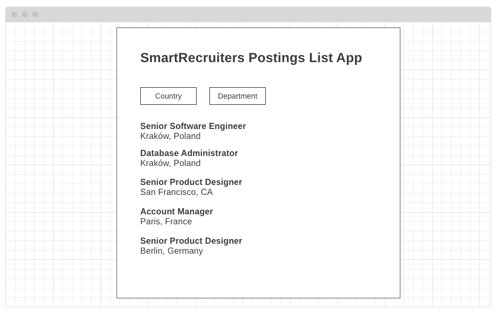

# SmartRecruiters Postings List App 


## User stories
- as a candidate, I want to see list of postings published by SmartRecruiters   
- as a candidate, I want to filter postings published by SmartRecruiters by `location.country` and `department`
- as a candidate, I want to see `jobAd.sections.jobDescription` and `jobAd.sections.jqualifications` of postings published by SmartRecruiters

<a name="#scenario"></a>
## Scenario
1. Open `localhost:8080`
2. Postings list loads
3. Candidate filter list by country and department
4. List displays only filtered elements
5. Click an item on the list
6. Posting details containing `jobAd.sections.jobDescription` and `jobAd.sections.jqualifications` section opens
7. Click `backlink` to return to the list

<a name="#wireframes"></a>
## Wireframes
### List of postings published by SmartRecruiters


### Posting details contatining `jobAd.sections.jobDescription` and `jobAd.sections.jqualifications` section


<a name="#public-api"></a>
## Public API
### Get list of postings published by SmartRecruiters
```GET  https://api.smartrecruiters.com/v1/companies/smartrecruiters/postings``` 

Demo: https://reqbin.com/fjiq2zrg    
Documentation: https://dev.smartrecruiters.com/customer-api/posting-api/endpoints/postings/     

### Get posting details
```GET https://api.smartrecruiters.com/v1/companies/smartrecruiters/postings/{postingID}```  

Demo: https://reqbin.com/sghcu97n       
Documentation: https://dev.smartrecruiters.com/customer-api/posting-api/endpoints/postingcontent/

### List of departments
```GET https://api.smartrecruiters.com/v1/companies/smartrecruiters/departments```  

Documentation: https://dev.smartrecruiters.com/customer-api/live-docs/posting-api/#/postings/v1.listDepartments

### List of countries
The countries dictionary is not yet exposed through Public API, but you can obtain the list using your preferred API, for example - https://restcountries.eu/

<a name="#faq"></a>